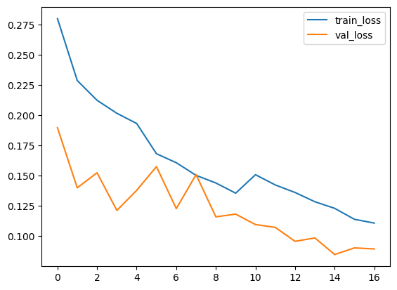
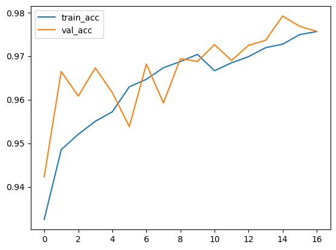

# A ViT based image classification pipeline

This computer vision project is built upon a kaggle competition. The data description can be found in [**Airbus Ship Detection Challenge**](https://www.kaggle.com/competitions/airbus-ship-detection/overview). 

The model is created on pretrained ViT model (vit_base_patch16_224) that is available from Lightning.ai.

Bellow shows the model loss and accuracy on training set and validation set. Due to limit computation resource, the training is only accomplished for 20 epochs.

Model loss on training and validation sets

Model accuracy on training and validation sets

